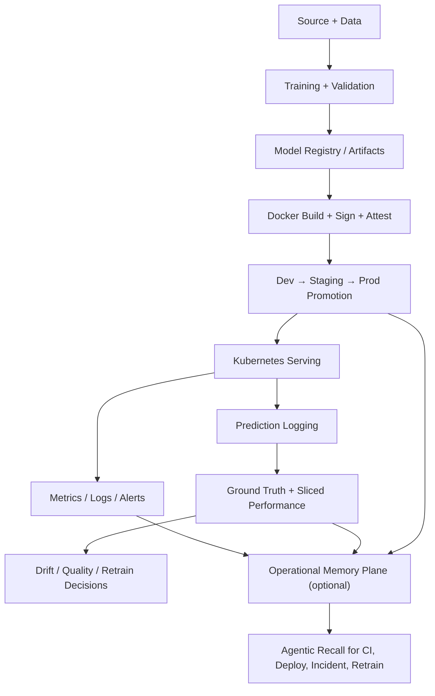

# ML-MLOps Production Template

Opinionated, production-grade template for building and operating ML systems on Kubernetes with multi-cloud deployment (GKE + EKS), governed CI/CD, closed-loop monitoring, supply-chain security, and agentic automation that stays inside enterprise guardrails.

[](https://github.com/DuqueOM/ML-MLOps-Production-Template/releases)
[](https://www.python.org/downloads/)
[](LICENSE)
[](https://www.terraform.io/)
[](https://kubernetes.io/)

[](https://github.com/DuqueOM/ML-MLOps-Production-Template/actions/workflows/validate-templates.yml)
[](https://codecov.io/gh/DuqueOM/ML-MLOps-Production-Template)
[](https://github.com/DuqueOM/ML-MLOps-Production-Template/generate)
[](#anti-patterns-encoded)
[](#agentic-system)

```bash
# scaffold a new ML service in under a minute
git clone https://github.com/DuqueOM/ML-MLOps-Production-Template.git
cd ML-MLOps-Production-Template
./templates/scripts/new-service.sh ChurnPredictor churn_predictor
```

**Start here:** [QUICK_START.md](QUICK_START.md) | [RUNBOOK.md](RUNBOOK.md) | [AGENTS.md](AGENTS.md) | [CONTRIBUTING.md](CONTRIBUTING.md)

---

## Who this is for

This template is designed for ML engineers and platform teams that are past the experimentation phase and ready to operate models with production discipline. The active public release line is `v0.x` hardening; `v1.0.0` is reserved for the first release with real cloud E2E evidence on GKE and EKS.

It fits:

- a **team shipping its first production ML service** that wants strong defaults without building a platform from scratch
- a **platform team** standardizing how ML services are built, deployed, monitored, and governed across multiple squads
- a **solo engineer or tech lead** who needs a reference implementation to anchor technical decisions and ADRs

It is not designed for data science notebooks, batch-only pipelines, or teams that have already adopted a full ML platform such as Vertex AI Pipelines or SageMaker Pipelines end-to-end.

---

## What this template is

This repository is a reference template for teams that want strong production defaults without adopting a heavyweight ML platform too early. It is intentionally opinionated where production failures are expensive and intentionally flexible where teams need domain-specific control.

It ships:

- Async ML serving patterns that avoid common Kubernetes and FastAPI failure modes.
- Multi-cloud Kubernetes and Terraform scaffolding for GCP and AWS.
- Environment promotion from `dev → staging → prod` with audit trail, approvals, digest-based deploys, signing, and attestations.
- Closed-loop monitoring with prediction logging, delayed ground truth, sliced performance, champion/challenger evaluation, and retraining hooks.
- Security controls for secrets, identity federation, SBOM generation, image signing, admission policy, and pod hardening.
- Agentic governance through `AUTO / CONSULT / STOP`, plus dynamic risk escalation based on live signals.

The template ALSO includes two **Phase 1 / contracts-only** capabilities — they are explicitly NOT runtime today, and the runtime work is gated on adopter feedback before opening Phase 2:

- Safe CI self-healing — see ADR-019. Today: classifier + policy contracts ship; runtime is shadow-only and writes nothing.
- Operational Memory Plane — see ADR-018. Today: `MemoryUnit` dataclass + redaction pipeline ship; ingest worker, vector store, and retrieval API are deferred.

If your adoption decision depends on either capability being live, the answer is "not yet" — they are roadmap items shipped as reviewable contracts, not as production features.

This is not a generic starter repo. It is a production template with encoded operating constraints.

---

## Production-ready scope

This is a hardened open-source baseline for enterprise-style ML services. The matrix below reports two distinct things:

1. **Designed-ready (verified L1+L2+L3)**: the patterns are contract-tested in this repo, render cleanly through `kustomize build`, and pass the golden-path E2E in kind. This is what every entry below means by default.
2. **Verified end-to-end (L4)**: the component has been exercised against a real cloud account, real cluster, real traffic. **Today, no entry below claims L4.** The L4 paper trail is owned by the adopter — see `VALIDATION_LOG.md`.

The previous wording ("Production-ready by design") was reworked in the May 2026 audit because reviewers consistently read the row as "production-ready, full stop," which over-promised the L4 gap.

| Area | Status | What that means |
|------|--------|-----------------|
| Service scaffold | Designed-ready (L1+L2+L3) | FastAPI serving, async inference, contract versioning, structured errors, domain hooks, tests, and observability are wired as first-class concerns. |
| Kubernetes runtime | Designed-ready (L1+L2+L3) | Single-worker pod model, split probes, startup gating, PDB, HPA, pod security labels, digest-pinned deploys, drift CronJob with PSS-restricted securityContext + init-container data fetch (May 2026 audit), and non-root runtime defaults are part of the base. |
| Multi-cloud infrastructure | Designed-ready (L1+L2+L3) | GCP and AWS both ship with environment separation, remote state, identity federation, secret manager patterns, and reproducible Terraform layouts. L4 cluster rollout is the adopter's responsibility. |
| CI/CD | Designed-ready (L1+L2+L3) | Build, scan, sign, attest, promote, smoke-test, drift-check, retrain (with audit trail + cosign blob signing of model artifacts after the May 2026 audit), and audit paths are governed and traceable. |
| Closed-loop monitoring | Designed-ready (L1+L2+L3) | Prediction logging, ground-truth ingestion, sliced performance analysis, drift heartbeat, and champion/challenger comparisons are part of the standard operating model. |
| Security and supply chain | Designed-ready (L1+L2+L3) | Secret scanning, SBOM, image signing, admission policy, **hard-fail tfsec/checkov/trivy with explicit baselines** (May 2026 audit HIGH-1), and least-privilege cloud identity are part of the deploy contract. |
| Agentic controls | Designed-ready (L1+L2+L3) | Static operation modes, dynamic risk escalation (with auth+TLS-pinned Prometheus signal source after May 2026 audit), typed handoffs, and auditable decisions are all encoded. |
| Agentic CI self-healing | Roadmap — Phase 1 contracts only | Classifier + policy contracts ship in shadow / read-only mode (ADR-019). NO writes, NO PRs, NO branch mutations today. Patch worker / verifier / write-enabled lanes are NOT implemented and are gated on 14 days of shadow precision data. |
| Operational Memory Plane | Roadmap — Phase 1 contracts only | `MemoryUnit` dataclass + 13-class redaction pipeline ship (ADR-018). Ingest worker, vector store, retrieval API are NOT implemented. Adopters cannot call retrieval APIs today; the section describes the target shape, not a live capability. |

External dependencies remain your responsibility: cloud accounts, Kubernetes clusters, MLflow backend, secret stores, and observability backends must exist before the template can operate in a real environment.

### Verification status

Four verification layers. Inside this repo the author can guarantee the first three; the fourth is per-adopter and cannot be asserted template-wide.

| Layer | Scope | Where it runs | Evidence in this repo |
|-------|-------|---------------|----------------------|
| **L1 — Contract tests** | Invariants on generated service code, schemas, policies, and agentic config | `.github/workflows/validate-templates.yml`; `templates/service/tests/test_*.py`; `make validate-templates` locally | 106 passing contract tests covering memory (ADR-018), CI self-healing (ADR-019), model-routing disclaimer, Phase-0/1 disclosure, anti-pattern count consistency, Locust ↔ API parity, PR evidence policy, CI autofix policy |
| **L2 — Scaffold smoke** | End-to-end scaffold of a fresh service + 6 overlay renders + kubeconform + binary audit | `.github/workflows/pr-smoke-lane.yml` on every PR; `make smoke` on demand (~60 s) | Green per PR; history in the Actions tab |
| **L3 — Golden path E2E** | Full chain: scaffold → build → sign → attest → deploy to kind → rollout Available → `/health` + `/ready` + `/predict` 2xx + metrics smoke | `.github/workflows/golden-path.yml` on release tags / schedule | Shipped; uses an explicit CI-only synthetic model fallback so runtime checks do not depend on cloud buckets |
| **L4 — Adopter production rollout** | Your cluster, your traffic, your SLOs, your compliance regime | Your CD pipeline + observability stack | **Not assertable from this repo.** Checklist lives in [`VALIDATION_LOG.md`](VALIDATION_LOG.md) §"Template for future entries" and [`docs/runbooks/`](docs/runbooks/). The R4 audit documents which runbooks are still pending execution by the author (secrets-integration-e2e, ground-truth ingestion SLA, Kyverno admission validation, secret history scan). |

If you are an adopter deciding whether to stake a production service on this template: L1 + L2 + L3 are your contract; L4 is an obligation the template cannot discharge for you. The `docs/audit/ACTION_PLAN_R4.md` + `VALIDATION_LOG.md` pair is the paper trail for what has already been executed vs. what is only shipped as policy.

---

### Recent hardening (v0.14.0 → v0.15.0)

Each release reports the gaps it closed against the most recent enterprise audit, with file-level evidence rather than a self-given numeric score.

`v0.14.0` (R5 hardening): scaffolded CI/CD now follows the documented single-service root layout, deploy workflows use the same kebab-case image vocabulary as Kustomize, the Python package is discoverable under `src/`, inference fails fast unless the training `FeatureEngineer` is available, and non-agentic runbook references resolve to real files.

`v0.15.0` (May 2026 audit response — this release): closed 4 critical, 9 high, 8 medium, and 2 low audit findings. Highlights:

- Drift `CronJob` now ships with PSS-restricted `securityContext` AND init-containers that fetch reference + production data into a shared volume (previously the file existed but lacked both, making the canonical kustomize stack fail-closed in any restricted namespace).
- `slo-prometheusrule.yaml` is now actually included in the base kustomization; previous releases shipped the file but left it out of `resources:`, so SLO burn-rate alerts never reached deployed clusters.
- Self-audit (tfsec/checkov/trivy) flipped from `soft_fail: true` to **hard-fail with explicit baselines** under `.security-baselines/`. The previous behaviour made CRITICAL findings silently green.
- `retrain-service.yml` now writes `audit_record` entries on every promotion AND signs `model.joblib` with cosign blob signing.
- `risk_context.py` now requires Bearer auth + TLS verification for the Prometheus signal query (previously plain HTTP, no auth).
- `ALLOW_MODELLESS_STARTUP=true` is now refused in `staging`/`production` environments.
- `argo-rollout.yaml` rewritten with full security parity to `deployment.yaml` (was previously a regression vector if enabled).
- README "Production-ready by design" wording softened to "Designed-ready (verified L1+L2+L3)" with explicit L4 gap call-out; numeric self-rating tables removed.

The full per-finding evidence is in [`VALIDATION_LOG.md`](VALIDATION_LOG.md) Entry 005.

L4 production rollout evidence remains the adopter's responsibility and the `v1.0.0` gate.

---

## Quick navigation

| If you want to... | Read first | Then |
|-------------------|------------|------|
| Scaffold a new ML service | [QUICK_START.md](QUICK_START.md) | `./templates/scripts/new-service.sh` |
| Understand the operating model | [AGENTS.md](AGENTS.md) | [docs/decisions/](docs/decisions/) |
| Review deployment and rollback flow | [RUNBOOK.md](RUNBOOK.md) | `templates/cicd/` and `templates/k8s/` |
| Evaluate security posture | [SECURITY.md](SECURITY.md) | `templates/infra/`, `templates/k8s/`, `templates/cicd/` |
| Extend agentic behavior | [AGENTS.md](AGENTS.md) | `templates/config/agentic_manifest.yaml`, `.windsurf/`, generated adapters |
| Contribute to the template | [CONTRIBUTING.md](CONTRIBUTING.md) | License and governance sections below |
| Cut a release | [docs/RELEASING.md](docs/RELEASING.md) | [CHANGELOG.md](CHANGELOG.md) |
| Migrate from a prior version | [MIGRATION.md](MIGRATION.md) | [CHANGELOG.md](CHANGELOG.md) |
| Verify what has actually been executed | [VALIDATION_LOG.md](VALIDATION_LOG.md) | [docs/audit/ACTION_PLAN_R4.md](docs/audit/ACTION_PLAN_R4.md) |

---

## Architecture overview



### Design principles

- The training, serving, monitoring, and retraining path is explicit and reviewable.
- The scaffolded repository is self-contained. It does not depend on hidden files from the template root after generation.
- The template uses strong defaults for production invariants and lets teams customize domain features, schema, model selection, thresholds, and integrations.
- Governance is additive. Dynamic signals can escalate a decision to a safer mode; they cannot silently weaken policy.

---

## Core capabilities

### Serving and APIs

- Async FastAPI serving with `run_in_executor` for CPU-bound inference.
- Single-worker pod model for correct HPA behavior.
- Request validation, contract versioning, snapshot-based API checks, and structured error envelopes.
- Model loading through init containers and shared volumes instead of baking models into images.
- Warm-up path for model readiness and SHAP explainer caching.

### Kubernetes and runtime

- Kustomize base plus six overlays: `gcp-dev`, `gcp-staging`, `gcp-prod`, `aws-dev`, `aws-staging`, `aws-prod`.
- CPU-only HPA, PodDisruptionBudget, NetworkPolicy, RBAC, non-root security context, and Pod Security Standards labels.
- Separate liveness, readiness, and startup probes.
- Digest-based deployment and immutable image flow.

### Infrastructure

- Terraform layouts separated by cloud and environment concerns.
- Remote state patterns for both GCP and AWS.
- Workload Identity and IRSA as the default runtime identity model.
- Example resource topology for buckets, registries, clusters, IAM, and observability prerequisites.

### CI/CD and controlled automation

- Build → scan → sign → attest → deploy → smoke-test promotion chain.
- Drift detection and retraining workflows as first-class operational paths.
- Audit trail written to JSONL and surfaced in GitHub Actions summaries.
- Controlled CI self-healing for low-risk failures with policy-based limits.

### Data validation and ML quality

- Pandera-based contracts for data validation.
- Leakage checks, baseline distributions, reproducibility hooks, and configurable quality gates.
- Fairness checks, champion/challenger evaluation, and retraining evidence packages.
- Versioned artifacts and model promotion rules that are designed to fail closed.

### Observability and closed-loop monitoring

- Prometheus metrics, structured logs, Grafana dashboards, and alert rules.
- Prediction logging with `prediction_id` and `entity_id` as required primitives.
- Delayed ground-truth ingestion, sliced performance monitoring, heartbeat monitoring, and trend analysis.
- Metrics and alerts designed for incident response and governed promotion.

### Security and supply chain

- Secret scanning, vulnerability scanning, SBOM generation, Cosign signing, and attestation.
- Admission-policy-oriented deployment posture.
- Least-privilege identity patterns for cloud access.
- Clear separation of dev, staging, and production credentials and approval paths.

### Technology stack

| Layer | Technologies | Coverage |
|-------|-------------|----------|
| ML and training | Python 3.11+, scikit-learn, XGBoost, LightGBM, Optuna | baseline models, ensembles, hyperparameter tuning |
| Serving and API | FastAPI, Uvicorn, Pydantic | async inference, contract validation, structured responses |
| Explainability | SHAP | feature attribution in original feature space |
| Data validation | Pandera, pandas, DVC | schema contracts, dataset versioning, reproducible pipelines |
| Model registry | MLflow, joblib | experiment tracking, model registry, serialized artifacts |
| Containers | Docker, multi-stage builds | image build, non-root runtime, init-container model loading |
| Kubernetes runtime | Kubernetes, Kustomize, HPA, PDB, NetworkPolicy | deployment, autoscaling, resilience, network isolation |
| Infrastructure | Terraform, GKE, EKS, GCS, S3, Artifact Registry, ECR | cloud provisioning, remote state, multi-cloud environment separation |
| Observability | Prometheus, Grafana, Alertmanager, Evidently | metrics, dashboards, alerting, drift and performance monitoring |
| CI/CD and security | GitHub Actions, Trivy, Syft, Cosign, Kyverno, gitleaks | build, scan, sign, attest, policy enforcement, secret detection |

---

## Agentic system

The template treats agent behavior as an engineering surface, not a prompt configuration.

The governance pattern is now single-source:

- `AGENTS.md` is the behavioral authority.
- `.windsurf/` stores canonical rule, skill, and workflow bodies.
- `templates/config/agentic_manifest.yaml` declares which surfaces consume each asset.
- `.cursor/`, `.claude/`, and `.codex/` contain generated pointer adapters only.

Run `make agentic-sync` after changing the manifest or canonical Windsurf files, then `make validate-agentic` to prove parity. Today the manifest exposes the same 15 rule files, 16 skills, and 12 workflows to Windsurf, Cursor, Claude, and Codex. The project shorthand "14 rules" refers to the numbered policy set; on disk, rule 04 is split into serving and training files.

### Static decision protocol

Every operation maps to one of three modes:

| Mode | Meaning | Examples |
|------|---------|----------|
| `AUTO` | Safe to execute without waiting for approval | scaffolding, docs, tests, local training, lint, read-only inspection |
| `CONSULT` | Propose plan and rationale, then wait for approval | staging deploys, workflow changes with moderate blast radius, non-prod infra changes |
| `STOP` | Block and require explicit human governance | production infra changes, quality-gate override, secret rotation, destructive cloud actions |

### Dynamic escalation

The template supports live escalation based on risk signals including:

- severe drift
- active incident
- exhausted error budget
- recent rollback
- off-hours deployment
- suspicious quality signals
- detected credential pattern

Dynamic escalation only moves toward a safer mode. It never downgrades a risky action.

### Typed handoffs and auditability

- Inter-agent handoffs use typed dataclasses instead of ad-hoc dictionaries.
- Every meaningful operation produces an audit entry.
- Consulted or blocked operations can be surfaced as GitHub issues with evidence.

See [AGENTS.md](AGENTS.md) for the canonical operation matrix and invariant catalog.

---

## Operational Memory Plane

> **Status — Phase 1 (contracts + redaction).** The canonical `MemoryUnit` dataclass and the gitleaks + PII redaction pipeline ship today: `templates/common_utils/memory_types.py` and `templates/common_utils/memory_redaction.py`, with 59 contract-test invariants enforcing immutability, severity normalization, sensitivity ≥ bucket-ACL minimum, single-tenant Phase 1 scope, idempotent redaction, and structural isolation from the `/predict` path. The ingest worker, the vector store, the retrieval API, and any agent-facing recall surface are **NOT yet implemented** in this template and are explicitly deferred per ADR-018 §Phase plan. Adopters cannot call retrieval APIs today; the section describes the **target shape** so the policy is reviewable before code lands. See [`ADR-018`](docs/decisions/ADR-018-operational-memory-plane.md) §Phase plan for the staged delivery.
>
> _Audit trail: Phase 0 disclosure added in response to R4 finding C2; transitioned to Phase 1 in the same audit-r4 sprint. See [`docs/audit/ACTION_PLAN_R4.md`](docs/audit/ACTION_PLAN_R4.md) §S0-2 + §S2-1._

The Operational Memory Plane is an optional companion capability for repos that want agents to draw on prior work without introducing hidden behavior.

### What it is

- A retrieval layer for prior incidents, deploy regressions, postmortems, drift events, training decisions, and successful fixes.
- A derived memory system, not the source of truth.
- Backed by structured metadata, embeddings, and evidence references to canonical artifacts.

### What it is not

- It is not in the synchronous `/predict` path.
- It does not change policy by itself.
- It does not replace audit logs, issues, runbooks, or ADRs.

### How it is used

- Before deploy: retrieve similar release failures and known bad remediation patterns.
- Before retrain: recall similar drift events, challenger outcomes, and previous thresholds.
- During incidents: retrieve similar symptoms, runbooks, and postmortem summaries.
- During CI repair: recall past failures and successful bounded fixes.

The operational rule is simple: memory can add context and escalate caution, but it cannot silently approve a risky action.

---

## Agentic CI self-healing

> **Status — Phase 1 (shadow, read-only).** The classifier and collector ship today: `scripts/ci_collect_context.py` and `scripts/ci_classify_failure.py`, governed by `templates/config/ci_autofix_policy.yaml` and `templates/config/model_routing_policy.yaml`, with 10 policy-contract invariants and 27 Phase-1 runtime invariants enforced by `test_ci_autofix_policy_contract.py` and `test_ci_classify_failure_phase1.py`. The classifier is wired into CI in **shadow mode only** — it observes failures and emits classifications, but **does NOT write code, does NOT open PRs, does NOT mutate any branch**. The patch worker, verifier, and write-enabled lanes are **NOT implemented yet** and are gated on 14 days of shadow data per ADR-019 §Phase plan. No agent will autonomously open a PR against your CI today. See [`ADR-019`](docs/decisions/ADR-019-agentic-ci-self-healing.md) §Phase plan for the staged delivery.
>
> _Audit trail: Phase 0 disclosure added in response to R4 finding C2; transitioned to Phase 1 in the same audit-r4 sprint. See [`docs/audit/ACTION_PLAN_R4.md`](docs/audit/ACTION_PLAN_R4.md) §S0-2 + §S1-6._

The template supports a bounded self-healing lane for CI. This is not "let the agent fix anything." It is a policy-governed repair loop with verification, audit, and branch isolation.

### Safety model

- Repairs happen on a dedicated branch, never directly on `main`.
- Blast radius is capped by file count, line count, and retry count.
- Protected paths and sensitive workflows are excluded from `AUTO`.
- Every fix must re-run targeted verification before it can be proposed.
- Failure to verify escalates the action to `CONSULT` or `STOP`.

### Repair matrix

| Failure class | Mode | Examples |
|---------------|------|----------|
| formatting drift | `AUTO` | lint formatting, imports, whitespace |
| documentation quality | `AUTO` | markdown issues, link fixes, generated docs drift |
| non-sensitive config syntax | `AUTO` | YAML, TOML, JSON syntax repairs in low-risk areas |
| fixture or snapshot alignment | `CONSULT` | test payload alignment, deterministic snapshot refresh |
| non-prod workflow repair | `CONSULT` | CI-only workflow fixes, path updates, harness repairs |
| security, auth, deploy, infra, or quality gate failures | `STOP` | secrets, identity, prod deploy, Terraform, fairness, drift, retrain gates |

This lane is designed to keep CI moving without allowing agent autonomy to leak into high-risk change surfaces.

---

## Model routing policy

The template treats model selection as a routing problem, not a brand decision.

### Routing roles

| Task type | Route | Expected behavior |
|-----------|-------|-------------------|
| failure classification, extraction, low-cost triage | low-cost router | prioritize speed and cost |
| small patch generation | patch worker | optimize for bounded code edits |
| diff review and risk evaluation | reviewer / gatekeeper | prioritize consistency and policy awareness |
| multi-file root cause analysis | escalation | use stronger reasoning only when needed |

### Provider stance

- OpenAI, Anthropic, and Google models can all fit this template.
- Stable, mid-cost workhorse models should handle the default lanes.
- Frontier models should be reserved for escalation paths, hard RCA, or advisory benchmarking.
- Preview models should not be used on protected branches or governance-critical workflows.

The important part is not the provider. It is the routing policy, verification layer, and operation mode boundaries.

### Recommended baseline (cadence-anticipated, **NOT** vendor-verified)

> **Status — Anticipated names, pending verification.** The model names in the snapshot table below follow the cadence the project's adopter requested (`gpt-5.x`, `claude-opus-4.x`, `gemini-3.x`). They have **NOT** been reconciled against the live catalog of any provider. Several names (e.g. `gpt-5.4`, `gpt-5.5`, `gemini-3.1-pro-preview`, `gemini-3-flash-preview`) may not exist at adoption time.
>
> Before enabling any of these names for a production-adjacent route, **verify against the provider dashboard** (see §"Verifying model availability before adoption" below) and update `verified_at` in [`templates/config/model_routing_policy.yaml`](templates/config/model_routing_policy.yaml). The ADR-019 contract test enforces routing **structure** (preview never on protected branches; AUTO mode never escalation-tier), not specific model identities.
>
> _Audit trail: this disclaimer was added in response to R4 finding C1 (cadence-anticipated names presented as verified). See [`docs/audit/ACTION_PLAN_R4.md`](docs/audit/ACTION_PLAN_R4.md) §S0-1._

#### Cadence-anticipated names — pending vendor verification

| Role | OpenAI | Anthropic | Google | Use it for |
|------|--------|-----------|--------|------------|
| **Router / cheap classify** | `gpt-5.4-nano` | `claude-haiku-4-5` | `gemini-2.5-flash-lite` | Failure triage, extraction, label classification |
| **Patch worker** | `gpt-5.4-mini` | `claude-haiku-4-5` | `gemini-2.5-flash` | Small patches, formatter fixes, doc edits |
| **Reviewer / gatekeeper** | `gpt-5.4` | `claude-sonnet-4-6` | `gemini-2.5-pro` | Diff review, risk evaluation, consistency check |
| **Hard escalation** | `gpt-5.5` | `claude-opus-4-6` | `gemini-2.5-pro` | Multi-file RCA, refactors with ripple, rare CI failures |
| **Frontier preview (non-prod only)** | — | — | `gemini-3.1-pro-preview`, `gemini-3-flash-preview` | Benchmarking lane, `workflow_dispatch` only — never on `main` |

The table above is a **structural recommendation** — four cost/quality tiers plus a non-prod preview lane. Substitute each cell with whichever model in that tier exists in your provider's catalog at adoption time.

#### Three pre-tuned structural profiles

The profiles below are described in cadence-anticipated names for continuity with the table above; treat the names as placeholders for tier slots, not commitments to specific models.

- **Maximum simplicity** (single family): `gpt-5.4-nano` → `gpt-5.4-mini` → `gpt-5.4` → `gpt-5.5`. Cleanest cost/quality gradient.
- **Mix cost + quality**: `gemini-2.5-flash-lite` (router) → `gpt-5.4-mini` (patcher) → `claude-sonnet-4-6` (reviewer) → `gpt-5.5` or `claude-opus-4-6` (escalation). Strong gatekeeper without paying frontier cost on every call.
- **Aggressive cost minimization**: `gemini-2.5-flash-lite` → `gemini-2.5-flash` → `gemini-2.5-pro` → escalation only when needed. Best volume economics.

#### Hard rules (codified in `ci_autofix_policy.yaml`)

- AUTO mode never uses escalation-tier models — bounded blast radius implies bounded reasoning need.
- Preview models are restricted to `workflow_dispatch` and benchmarking lanes; they cannot land on protected branches. The contract test refuses configurations that violate this.
- Memory-plane signals (ADR-018) can route a query to a more capable model on `repeat_failure_pattern`, but never the other way around — same escalation-only discipline as ADR-010.

#### Verifying model availability before adoption

Before enabling any name from the table above for a production-adjacent route, verify it exists in the provider's stable catalog **on the day of adoption** and update `verified_at` in [`templates/config/model_routing_policy.yaml`](templates/config/model_routing_policy.yaml).

| Provider | Where to verify | Catalog scope to confirm |
|----------|-----------------|---------------------------|
| OpenAI | [`platform.openai.com/docs/models`](https://platform.openai.com/docs/models) | Model name appears under "Current models" (not "Deprecated" or "Legacy"); pricing and rate-limit tier acceptable for the route's expected volume |
| Anthropic | [`docs.anthropic.com/en/docs/about-claude/models`](https://docs.anthropic.com/en/docs/about-claude/models) | Model name appears in the active models table; check the `model_id` column matches what your client will send |
| Google | [`ai.google.dev/gemini-api/docs/models`](https://ai.google.dev/gemini-api/docs/models) and Vertex AI Model Garden | Confirm GA vs preview status; preview models are restricted to non-protected lanes by `model_routing_policy.yaml` |

**Process**:

1. Open the dashboard above for each provider you intend to use.
2. For every cell of the recommended-baseline table you plan to enable, confirm the model name still exists and is in the maturity tier the YAML expects (`stable` or `preview`).
3. If a name no longer exists, the routing layer falls back to the next candidate in the route — it never silently switches families. Replace the missing name with a verified equivalent and bump `verified_at`.
4. Reviewers MUST re-verify before any rollout to a protected branch.

#### Honesty caveat

Vendor model names rotate every 6–12 months. The `verified_at` field in `model_routing_policy.yaml` declares when the catalog was last reconciled. The names in the table above are anticipated based on the project's adopter cadence and have not been reconciled against any vendor catalog at the time of writing.

---

## Anti-patterns encoded

The template encodes and audits 32 production anti-patterns across serving, training, Kubernetes, Terraform, security, observability, and delivery.

| ID | Anti-pattern | Corrective action |
|----|--------------|-------------------|
| D-01 | `uvicorn --workers N` in Kubernetes | Use one worker per pod and move CPU-bound inference into `ThreadPoolExecutor`. |
| D-02 | Memory as an HPA metric for ML pods | Use CPU-only HPA so scale-down remains meaningful. |
| D-03 | `model.predict()` called directly in an async endpoint | Wrap inference with `run_in_executor`. |
| D-04 | `shap.TreeExplainer` with ensemble or pipeline models | Use `KernelExplainer` with a stable prediction wrapper. |
| D-05 | Exact `==` version pinning for ML dependencies | Use compatible release pinning (`~=`) and automate updates through Dependabot. |
| D-06 | Unrealistically high primary metric | Treat as a leakage investigation, not as a promotion win. |
| D-07 | SHAP background sample contains only one class | Replace with a representative background sample. |
| D-08 | PSI computed with uniform bins | Use quantile-based bins derived from the reference distribution. |
| D-09 | Drift detection without heartbeat alerting | Add heartbeat alerting for broken or stalled CronJobs. |
| D-10 | `terraform.tfstate` committed to Git | Move state to remote storage and rotate exposed credentials immediately. |
| D-11 | Model artifacts baked into the Docker image | Download models at runtime through init containers and shared volumes. |
| D-12 | No quality gates before promotion | Enforce metrics, fairness, leakage, and integrity gates before deploy. |
| D-13 | EDA executed directly on production data | Work from an isolated copy under `data/raw/` and keep EDA out of prod paths. |
| D-14 | Pandera schema without observed bounds from EDA | Add observed ranges and constraints derived from exploratory analysis. |
| D-15 | Baseline distributions not persisted for drift | Save and version baseline distributions for drift consumers. |
| D-16 | Feature engineering without rationale | Document feature proposals and tie them to EDA evidence. |
| D-17 | Hardcoded credentials in code or config | Use secret manager integrations through shared utilities. |
| D-18 | Static AWS keys or GCP JSON keys in production | Use IRSA on AWS and Workload Identity on GCP. |
| D-19 | Unsigned images or missing SBOM in production | Sign images, generate SBOMs, and enforce them at admission time. |
| D-20 | Prediction logs missing `prediction_id` or `entity_id` | Require both fields for traceability and ground-truth joins. |
| D-21 | Prediction logging blocks the async event loop | Buffer and flush logging asynchronously in the background. |
| D-22 | Logging backend failure leaks into the HTTP response path | Swallow logging failures and surface them as observability counters. |
| D-23 | Shared liveness and readiness endpoint | Split `/health`, `/ready`, and startup gating for warm-up correctness. |
| D-24 | SHAP explainer rebuilt on every request | Build once during warm-up and reuse from application state. |
| D-25 | Pod can be terminated mid-request | Keep `terminationGracePeriodSeconds` above the graceful shutdown timeout. |
| D-26 | Deploys bypass staging validation | Enforce dev → staging → prod promotion with environment approvals. |
| D-27 | Deployment ships without a PodDisruptionBudget | Require a PDB and sane minimum replica assumptions. |
| D-28 | Breaking API change without version bump and snapshot refresh | Refresh the OpenAPI snapshot and apply semantic version discipline. |
| D-29 | Namespace missing Pod Security Standards labels | Label namespaces and enforce the correct pod security level by environment. |
| D-30 | Production image lacks SBOM attestation | Attach a CycloneDX SBOM attestation as part of the signed release chain. |
| D-31 | Monolithic IAM identity for ci/deploy/runtime/drift/retrain | Per-purpose, per-environment service accounts with WIF (GCP) and IRSA (AWS); enforced by `tests/test_iam_least_privilege.py`. |
| D-32 | K8s manifests reference Python paths with kebab-case placeholders | Python module paths use `{service}` (snake), never `{service-name}` (kebab); enforced by `tests/policy/test_anti_patterns.py::test_d32_drift_cronjob_python_path`. |

The full invariant text and operating rules live in [AGENTS.md](AGENTS.md).

---

## Repository structure

```text
templates/
  service/            FastAPI app, training package, tests, Dockerfile
  common_utils/       shared contracts, audit, secrets, persistence, telemetry
  k8s/                base manifests, overlays, policies, monitoring rules
  infra/              Terraform for GCP and AWS, local MLflow helpers
  cicd/               GitHub Actions workflow templates
  scripts/            scaffolding, deploy, health, promotion helpers
  docs/               ADR templates, runbooks, service docs, release assets
  monitoring/         Grafana and Prometheus templates

examples/
  minimal/            local end-to-end demo (train, serve, drift check)

docs/
  decisions/          template-level ADRs
  runbooks/           cloud-specific setup and incident runbooks
  incidents/          incident record templates

.windsurf/
.cursor/
.claude/
  rules, skills, workflows, and parity shims for supported IDEs
```

<details>
<summary>Expanded repository tree</summary>

```text
templates/
  service/
    app/
      main.py
      fastapi_app.py
      schemas.py
    src/{service}/
      training/
        train.py
        features.py
        evaluate.py
      monitoring/
        drift_detection.py
        performance_monitor.py
      schemas.py
    tests/
      unit/
      integration/
      contract/
      load_test.py
    scripts/
      refresh_contract.py
      benchmark_executor.py
    Dockerfile
    pyproject.toml
    requirements.txt
    dvc.yaml
  common_utils/
    agent_context.py
    risk_context.py
    secrets.py
    prediction_logger.py
    telemetry.py
  k8s/
    base/
      deployment.yaml
      hpa.yaml
      pdb.yaml
      networkpolicy.yaml
      rbac.yaml
      slo-prometheusrule.yaml
    overlays/
      gcp-dev/
      gcp-staging/
      gcp-prod/
      aws-dev/
      aws-staging/
      aws-prod/
    policies/
      pod-security-standards.yaml
  infra/
    terraform/
      gcp/
      aws/
    docker-compose.mlflow.yml
  cicd/
    ci.yml
    deploy-common.yml
    drift-detection.yml
    retrain-service.yml
  scripts/
    new-service.sh
    deploy.sh
    promote_model.sh
    health_check.sh
  docs/
    ADR-template.md
    runbook-template.md
    CHECKLIST_RELEASE.md
  monitoring/
    grafana/
    prometheus/

docs/
  decisions/
  runbooks/
  incidents/
  internal/

examples/
  minimal/
    train.py
    serve.py
    drift_check.py

.windsurf/
  rules/
  skills/
  workflows/
.cursor/
  rules/
  commands/
  skills/
.claude/
  rules/
  commands/
  skills/
```

</details>

---

## Quick start

### 1. Try the demo

```bash
make bootstrap
make demo-minimal
```

Or run the minimal example step by step:

```bash
cd examples/minimal
pip install -r requirements.txt
python train.py          # train and register the model artifact
uvicorn serve:app --host 0.0.0.0 --port 8000 &   # serve predictions
python drift_check.py    # verify drift detection baseline
```

### 2. Scaffold your own service

```bash
./templates/scripts/new-service.sh FraudDetector fraud_detector
cd FraudDetector
pytest
```

### 3. Wire your environment

Before deploying to a cloud environment, configure the following. Runbooks for each step live under `docs/runbooks/`.

- cloud identity federation (Workload Identity or IRSA)
- remote Terraform state backend
- secret store integrations
- MLflow tracking and registry backend
- observability backends (Prometheus, Grafana, Alertmanager)
- GitHub Environment protections and required reviewers

---

## Release and operate

Typical flow:

1. Build and test in CI.
2. Scan dependencies and container image.
3. Generate SBOM and sign by digest.
4. Deploy to `dev`.
5. Promote to `staging` with approval.
6. Validate smoke tests, SLOs, and quality signals.
7. Promote to `prod` through protected environments.
8. Monitor closed-loop metrics, drift, and incident signals.
9. Retrain only through the governed quality gate path.

Deploy, incident, and retrain are part of one operating model, not separate ad-hoc scripts.

---

## Adoption boundary

For platform reviewers asking *"is this ready for our org?"* and teams that want to adopt the template **without using AI agents**, see [`docs/ADOPTION.md`](docs/ADOPTION.md). It contains:

- **Maturity matrix** per capability × cloud × environment (dev/staging/prod), with explicit `ready` / `partial` / `roadmap` ratings
- **Non-agentic on-ramp**: every `/slash` workflow has a `make` equivalent or runbook reference; teams that don't use AI assistants get the same safety guarantees through `make` targets and contract tests
- **Explicit non-claims**: what the template does NOT cover (multi-region active-active, compliance certifications, LLM serving, mobile/edge inference)

The agentic surface is a productivity multiplier; it is not a load-bearing component of the template's safety guarantees. All production invariants (D-01..D-32) live in tests, CI workflows, and Kyverno policies — not in agent behavior.

---

## Scope boundaries

**Included:**

- single-service and small-to-medium team MLOps patterns
- multi-cloud Kubernetes deployment (GKE and EKS)
- production CI/CD, supply-chain security, monitoring, and retraining paths
- agentic governance and bounded automation for Windsurf, Cursor, and Claude Code

**Not included by default:**

- full workflow orchestration platforms (Airflow, Prefect, Kubeflow Pipelines)
- feature store platform ownership
- multi-region active-active failover
- complex canary meshes beyond the documented rollout boundary
- compliance programs that require dedicated legal or regulated tooling

If you outgrow the template, the documented invariants and ADRs are designed to survive that transition.

---

## Real-world origin

This template was extracted from [ML-MLOps-Portfolio](https://github.com/DuqueOM/ML-MLOps-Portfolio), where the patterns were developed and validated across multiple ML services, ADRs, tests, and cloud deployments.

The goal is not to mirror that portfolio one-to-one. The goal is to package the stable, reusable operating patterns into a template that other teams can adopt without starting from scratch.

---

## Contributing

This project uses the Developer Certificate of Origin (DCO).

By contributing, you certify that:

- you have the right to submit your contribution
- you agree to license your work under the Apache License 2.0

All commits must be signed off:

```bash
git commit -s -m "your message"
```

This adds the required `Signed-off-by` line to your commit. No CLA is required.

See [CONTRIBUTING.md](CONTRIBUTING.md) for the full contribution process, issue templates, and ADR conventions.

Questions and discussion: [file an issue](https://github.com/DuqueOM/ML-MLOps-Production-Template/issues/new/choose).

---

## License

This project is licensed under the Apache License 2.0. See the [LICENSE](LICENSE) file for details.

---

## AI transparency

This repository is intentionally designed for human-governed, AI-assisted engineering.

- Agents accelerate repetitive work.
- Policies, tests, reviews, and audit logs constrain agent autonomy.
- Architecture, risk acceptance, and production accountability remain human responsibilities.

The goal of this template is safer automation, not ungoverned automation.
